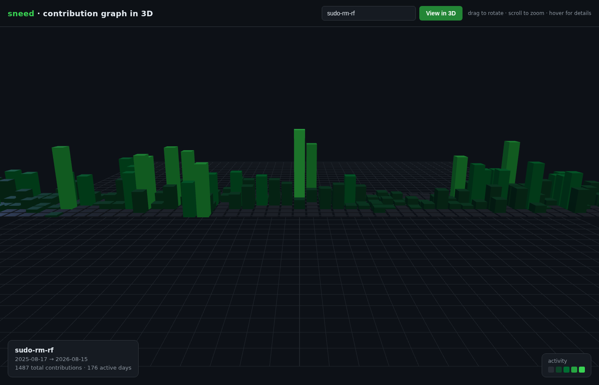

# sneed

View **any GitHub account's contribution graph in 3D** — submit a username and get a
rotatable, zoomable field of vertical bars, one bar per day, colored by activity level
exactly like the GitHub heatmap.



## Features

- 🧊 **True 3D** — every day is a vertical bar; heights scaled to your busiest day
- 🖱️ **Orbit + zoom** — drag to rotate, scroll to zoom, damped smoothness
- 🔍 **Hover** — point at a bar to see the exact date and contribution count
- 🎨 **GitHub-accurate colors** — the classic 5-level green scale
- 📅 **Full year** — the entire ~53-week contribution window
- ⚡ **No token needed** — the backend reads the public profile page directly

## Run it

```bash
npm install
npm start
# → http://localhost:8080
```

Then type a GitHub username and hit **View in 3D**. Try `sudo-rm-rf`, `gaearon`,
`torvalds`, or yourself.

## How it works

- **Backend** (`server.js`): a tiny [Express](https://expressjs.com) server. On
  `GET /api/three/:username` it fetches the public GitHub contribution calendar and
  extracts every day's `data-count`/`data-date` — no API token required.
- **Frontend** (`public/index.html`): [Three.js](https://threejs.org) renders each day
  as an instanced box in a calendar grid (weeks × days), with `OrbitControls` for
  rotation and zoom, and a raycast-based hover readout.

## Deploy

`PORT` is honored from the environment, so it runs on any Node host (Render, Railway,
Fly, a VPS). Static hosting alone won't work — the `/api/three/*` proxy needs a server.

## License

MIT